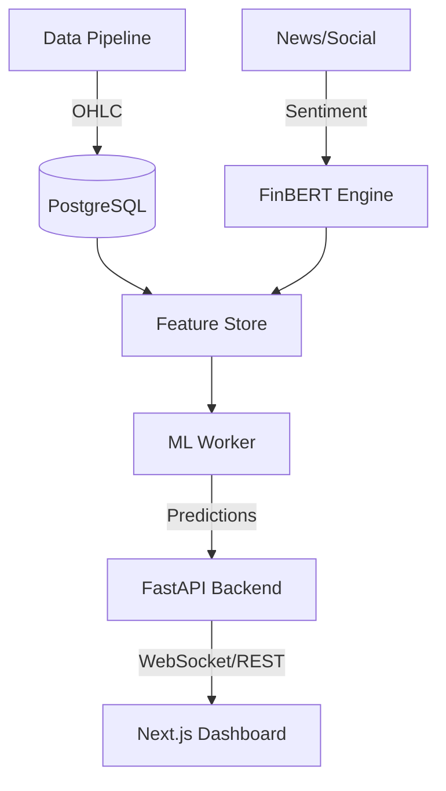

# AlphaForge: AI Stock Market Intelligence Platform

AlphaForge is a production-grade, modular platform designed for stock market analysis and prediction. It leverages state-of-the-art quantitative finance and machine learning techniques to help traders and researchers generate insights.

## 🚀 Key Features
- **Real-time Data Pipeline**: Multi-source market data ingestion (NSE/BSE focus).
- **Advanced Feature Engineering**: 15+ technical indicators (RSI, MACD, Bollinger Bands, etc.).
- **Sentiment Engine**: FinBERT-powered sentiment analysis for financial news.
- **Predictive Modeling**: XGBoost and Deep Learning for directional movement forecasting.
- **Interactive Dashboard**: Modern Next.js UI with real-time technical & AI charts.
- **Trading Signals**: Actionable Buy/Sell/Hold signals based on multi-factor scoring.

## 🏗 Architecture


## 🛠 Tech Stack
- **Backend**: FastAPI, SQLAlchemy, Redis
- **Frontend**: Next.js, Tailwind CSS, Recharts
- **ML/Quant**: XGBoost, Scikit-learn, TA-Lib, Transformers (FinBERT)
- **Database**: PostgreSQL (Structured), MongoDB (Unstructured)
- **DevOps**: Docker, Docker Compose

## 🚦 Getting Started

### 1. Requirements
- Python 3.10+
- Node.js 18+
- Docker & Docker Compose

### 2. Setup
```bash
# Clone the repository
git clone https://github.com/prakashwaddar628/AlphaForge.git
cd AlphaForge

# Install Python dependencies
pip install -r requirements.txt

# Run Data Ingestion & Training
python data_ingestion/fetch_prices.py
python data_ingestion/feature_engineering.py
python ml_worker/train_model.py

# Start Backend
python backend/main.py

# Start Frontend
cd frontend
npm install
npm run dev
```

## 📄 Documentation
- [PRD.md](./PRD.md): Product Requirements Document
- [DESIGN.md](./DESIGN.md): System Design and Architecture Details
- [task.md](file:///C:/Users/praka/.gemini/antigravity/brain/13061557-e102-4263-93a8-772973f6c52b/task.md): Project Milestones (Internal)

---
**Disclaimer**: This platform is intended for research and educational purposes. AlphaForge does not provide financial advice. Trading involves significant risk.
